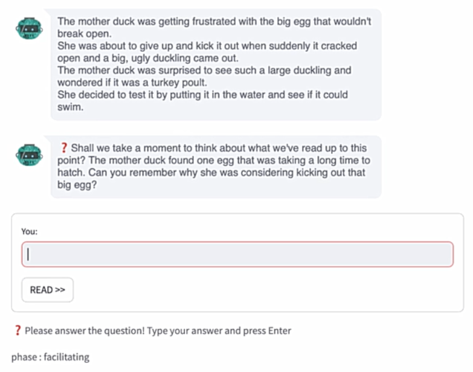
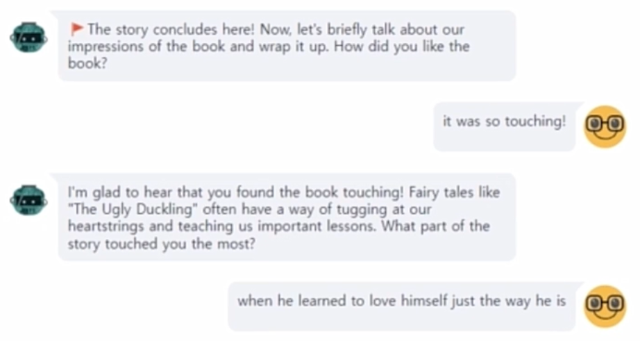

# JUDY: Journey for Understanding and Discussing FairYtales with chatbot

A model that enhances storytime by asking children interactive questions at intervals, fostering engagement and adapting storytelling based on their responses.

*This is a team project for the Fall 2023 Conversational AI course at Seoul National University.

---

## Dataset

**FairytailQA**
https://github.com/uci-soe/FairytaleQAData

---

## Framework

The service is composed of four stages:
- **Greeting**: Deciding which fairy tale book to read
- **Reading**: Reading the sections in order from the selected book
- **Facilitating**: Asking questions to the child about the section
- **Wrap-up**: Sharing reflections after finishing the book

---

## Demo

